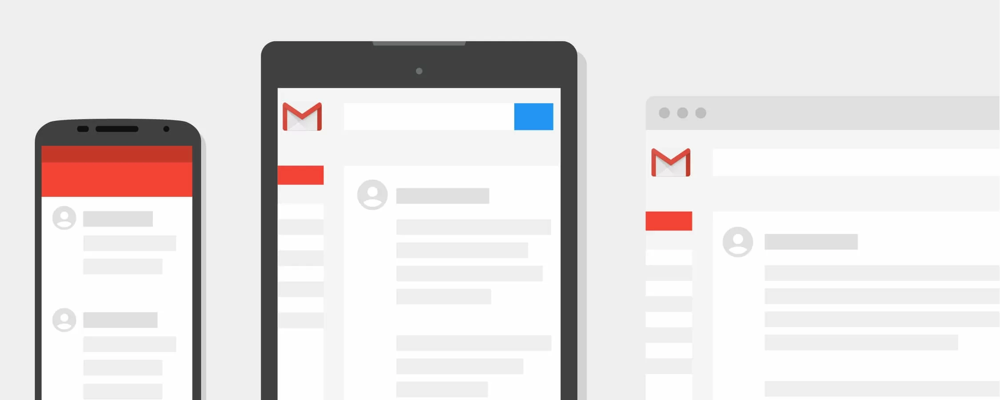

# BitCache

BitCache brings a **native** **Web3** user experience to BSV by adding a caching layer for your onchain data.

A UX where you can avoid vendor lock-in and walled gardens because your data is onchain and you can move seamlessly from wallet/app interface to interface without any expensive process involved.&#x20;

This is similar to the UX with email. You can easily move across email clients such as Apple mail, Gmail, Microsoft Outlook, Thunderbird, while still using the same email address and the same email history.

<figure><figcaption></figcaption></figure>
