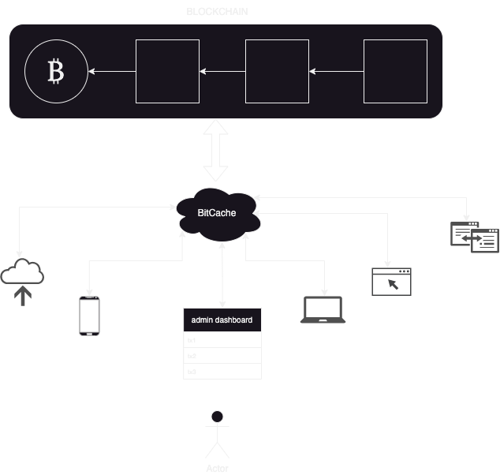

# System Architecture

With native locking/unlocking functionality within the wallet (connected to your hardware wallet), plus an admin wallet interface where you can see all of your onchain txs from one screen.

<figure><figcaption></figcaption></figure>

With your onchain data, you have 2 options. Either:

1- you filter through all transactions after they are settled onchain and index the ones you need (EXPENSIVE - needs to scale as blockchain scales)

OR

2- you cache the transactions you need as they get settled onchain (CHEAP - only scales as your data volume scales)
